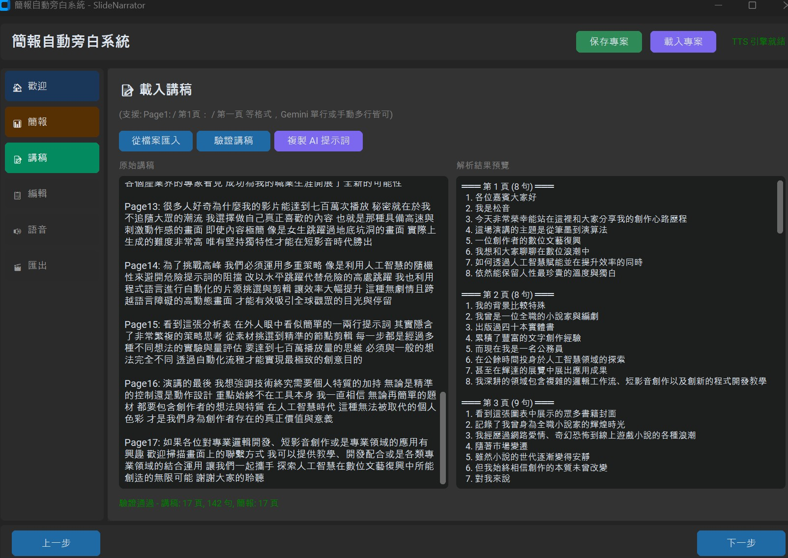
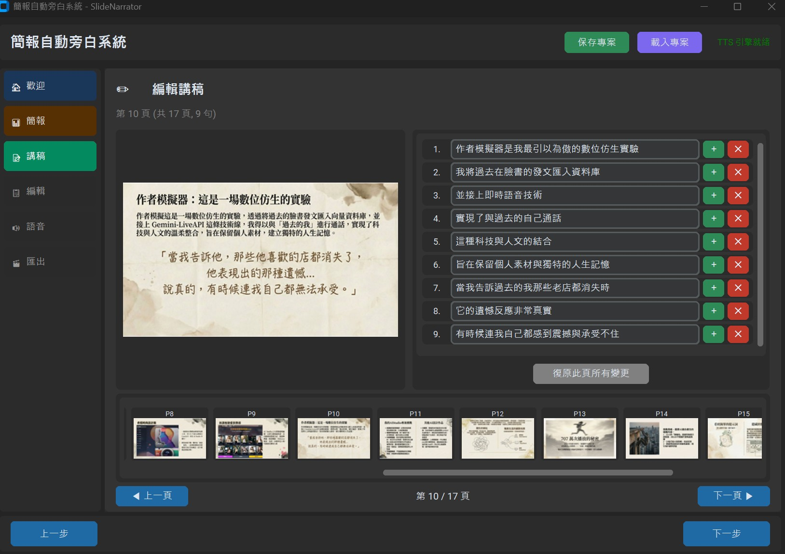
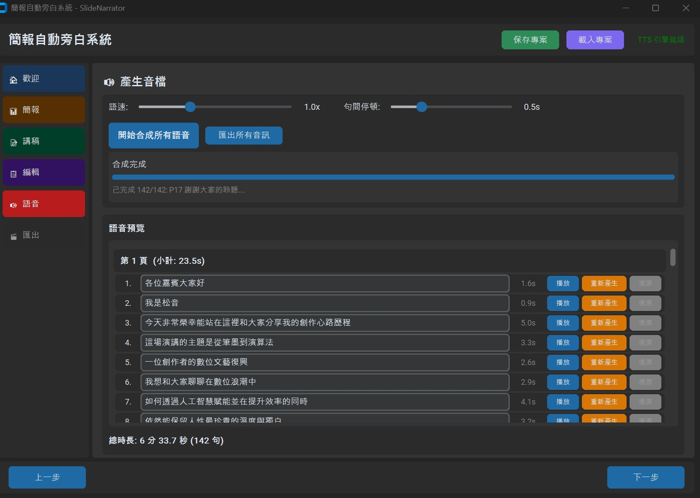
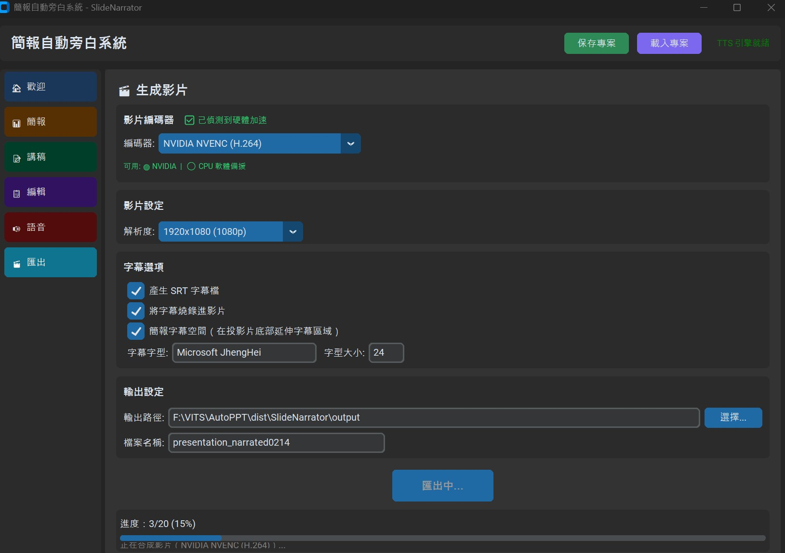

# SlideNarrator - 智能簡報自動旁白系統

SlideNarrator 是一款基於 Python 開發的自動化工具，旨在協助使用者快速將簡報 (PowerPoint/圖片) 與講稿結合，生成帶有高品質 TTS (文字轉語音) 旁白與自動同步字幕的簡報影片。

本專案核心採用 **Sherpa-onnx** 技術，能在一般的 CPU 環境下達成極速推理，無需昂貴的 GPU 即可產出流暢的語音。

## 🌟 核心功能

- **🚀 高效率 TTS 推理**：使用 ONNX 模型，支援純 CPU 運行，推理速度遠快於傳統 VITS 模型。
- **🎬 自動化影片合成**：自動將講稿分句並產生音檔，計算語速後自動拉伸或循環簡報圖片，生成完美契合的旁白影片。
- **📜 自動生成字幕**：根據語音實際長度，精準生成 SRT 字幕檔案。
- **🎨 現代化介面**：基於 `CustomTkinter` 打造的 Modern UI，操作直觀流暢。
- **⚡ 硬體加速支援**：自動偵測 NVIDIA GPU，支援硬體編碼 (H.264/HEVC) 以加速影片輸出。
- **📦 獨立運行**：支援打包為 Windows `.exe` 執行檔，免去環境配置煩惱。

## 🛠️ 技術棧

- **TTS 引擎**: [Sherpa-onnx](https://github.com/k2-fsa/sherpa-onnx)
- **介面框架**: [CustomTkinter](https://github.com/TomSchimansky/CustomTkinter)
- **影片處理**: [FFmpeg](https://ffmpeg.org/)
- **語言**: Python 3.10+

## 📥 安裝與準備

### 1. 安裝環境依賴
```bash
pip install -r requirements.txt
```

### 2. FFmpeg 準備
請確保您的系統已安裝 `ffmpeg`，並將其路徑加入環境變數中，或放置於專案根目錄的 `ffmpeg` 資料夾。

### 3. 模型放置
請將 TTS 模型檔案放置於 `models/` 目錄下。
本專案建議使用由 **MediaTek Research** 提供之 [Breeze2-VITS-onnx](https://huggingface.co/MediaTek-Research/Breeze2-VITS-onnx/tree/main) 模型：
- `*.onnx` (模型檔，例如：`breeze2-vits.onnx`)
- `tokens.txt`
- `lexicon.txt`
- `*.json` (配置檔)

## 📖 使用指南

執行 `python main.py` 開啟程式，依照步驟引導完成簡報旁白影片製作。

### 步驟 1：載入簡報

新建專案後，載入 PPTX 或 PDF 簡報。可載入 NotebookLM 的 PDF 簡報，或使用標準 PPTX（使用 PPTX 時，系統必須已安裝 PowerPoint）。


### 步驟 2：載入講稿

載入簡報後，先複製 AI 提示詞，到 Gemini 或其他線上 AI 模型去上傳簡報，並以 AI 提示詞讓 AI 解讀簡報內容。



完成後會得到類似 `Page1: ...` 的結果，再把結果用 `Ctrl+V` 貼上，或是儲存成文字檔載入。完成後驗證講稿內容的段落與頁面是否正確。


### 步驟 3：編輯講稿

驗證完講稿內容後，可編輯、增減每張簡報的台詞，也可透過底部縮圖快速跳到指定頁面進行編輯。



### 步驟 4：產生音檔

確認並產生語音檔案。此階段也可以修改文字，播放、確認產生結果。



### 步驟 5：匯出影片

最後步驟，匯出簡報影片檔案。可選擇增加畫面空間讓字幕確實被顯示，也可匯出對應的 SRT 格式字幕檔案。



## 🏗️ 專案開發計畫 (Roadmap)

- [x] 整合 Sherpa-onnx 語音推理
- [x] 自動化影片/字幕同步邏輯
- [x] NVIDIA 硬體加速編碼偵測
- [ ] 支援多國語言 TTS 混合
- [x] 支援 PDF 直接匯入轉圖片

## ⚖️ 開源協議 (License)

本專案基於 MIT 協議開源。
